UML Diagram for Kotlin Design Pattern Examples
===

This project lists UML diagrams of the "[Design Pattern Examples in Kotlin](https://github.com/takaakit/design-pattern-examples-in-kotlin)". When you click on a diagram image below, the diagram will be opened in <b>Diagram Map</b>. If you want to know about <b>Diagram Map</b>, please see the post below.  
[https://dev.to/takaakit/diagram-map-tracing-uml-sysml-elements-across-diagrams-49i7](https://dev.to/takaakit/diagram-map-tracing-uml-sysml-elements-across-diagrams-49i7)

Behavioral Patterns
---
|  |  |  |
| :---: | :---: | :---: |
| **Chain of Responsibility** | **Command** | **Interpreter** |
|  <a href="https://github.com/takaakit/design-pattern-examples-in-kotlin/tree/master/src/main/kotlin/behavioralPatterns/chainOfResponsibility">Kotlin Code</a> | <a href="https://htmlpreview.github.io/?https://github.com/takaakit/uml-diagram-for-kotlin-design-pattern-examples/blob/master/behavioralPatterns/command/DiagramMap.html">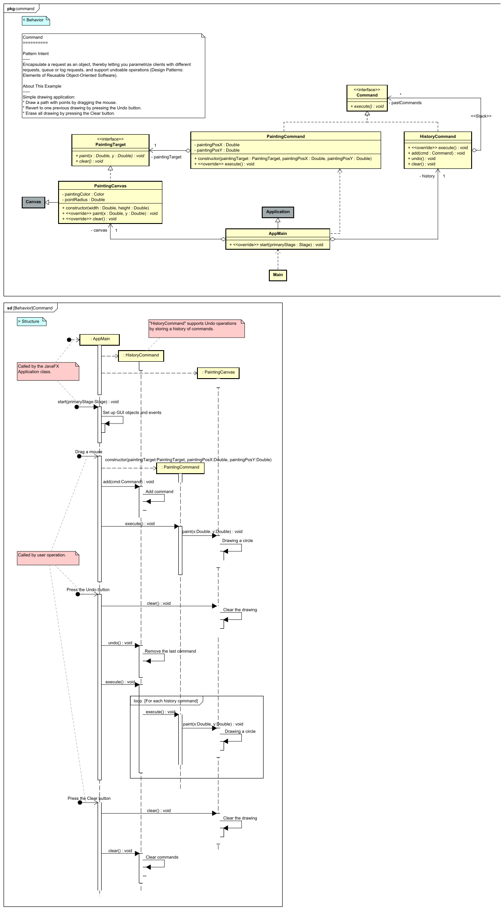</a> <a href="https://github.com/takaakit/design-pattern-examples-in-kotlin/tree/master/src/main/kotlin/behavioralPatterns/command">Kotlin Code</a> | <a href="https://htmlpreview.github.io/?https://github.com/takaakit/uml-diagram-for-kotlin-design-pattern-examples/blob/master/behavioralPatterns/interpreter/DiagramMap.html">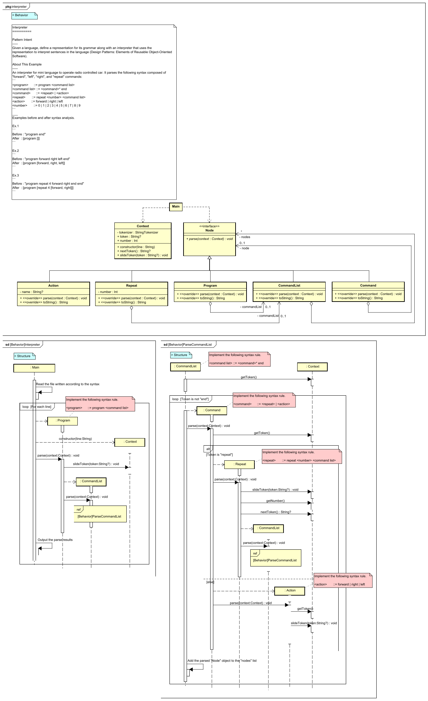</a> <a href="https://github.com/takaakit/design-pattern-examples-in-kotlin/tree/master/src/main/kotlin/behavioralPatterns/interpreter">Kotlin Code</a> |
| **Iterator** | **Mediator** | **Memento** |
| <a href="https://htmlpreview.github.io/?https://github.com/takaakit/uml-diagram-for-kotlin-design-pattern-examples/blob/master/behavioralPatterns/iterator/DiagramMap.html">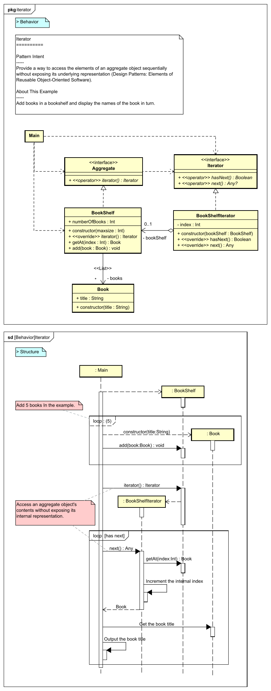</a> <a href="https://github.com/takaakit/design-pattern-examples-in-kotlin/tree/master/src/main/kotlin/behavioralPatterns/iterator">Kotlin Code</a> | <a href="https://htmlpreview.github.io/?https://github.com/takaakit/uml-diagram-for-kotlin-design-pattern-examples/blob/master/behavioralPatterns/mediator/DiagramMap.html">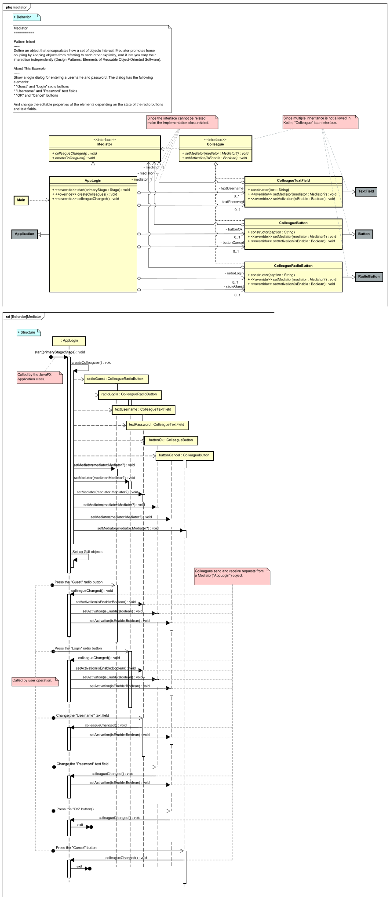</a> <a href="https://github.com/takaakit/design-pattern-examples-in-kotlin/tree/master/src/main/kotlin/behavioralPatterns/mediator">Kotlin Code</a> | <a href="https://htmlpreview.github.io/?https://github.com/takaakit/uml-diagram-for-kotlin-design-pattern-examples/blob/master/behavioralPatterns/memento/DiagramMap.html">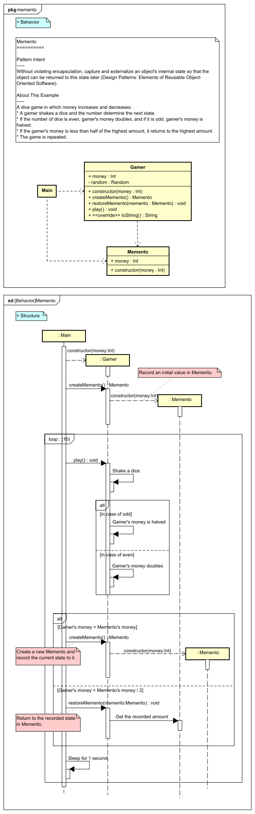</a> <a href="https://github.com/takaakit/design-pattern-examples-in-kotlin/tree/master/src/main/kotlin/behavioralPatterns/memento">Kotlin Code</a> |
| **Observer** | **State** | **Strategy** |
| <a href="https://htmlpreview.github.io/?https://github.com/takaakit/uml-diagram-for-kotlin-design-pattern-examples/blob/master/behavioralPatterns/observer/DiagramMap.html">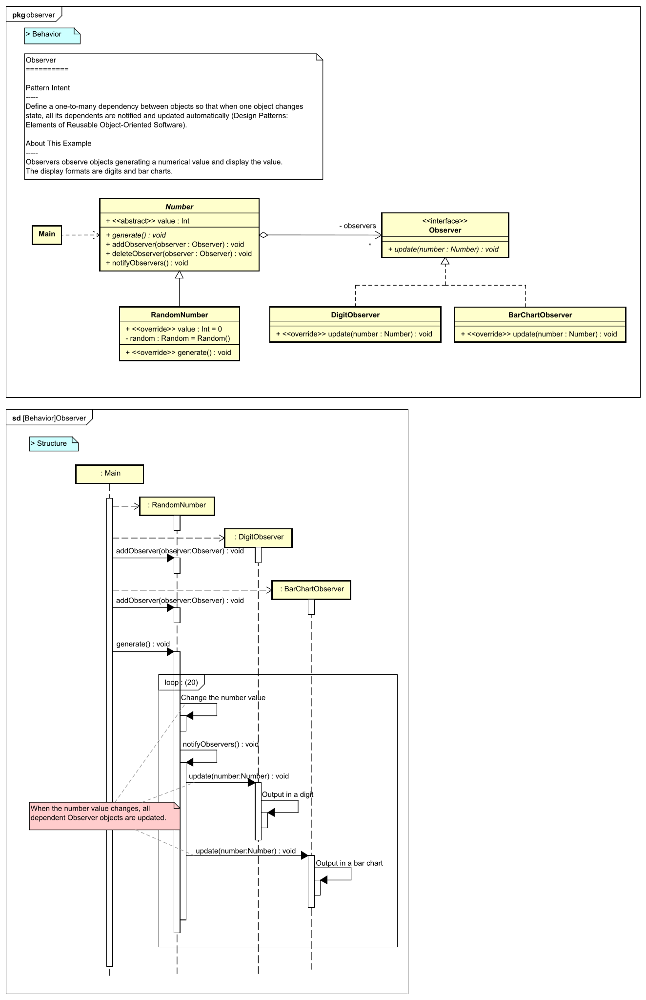</a> <a href="https://github.com/takaakit/design-pattern-examples-in-kotlin/tree/master/src/main/kotlin/behavioralPatterns/observer">Kotlin Code</a> | <a href="https://htmlpreview.github.io/?https://github.com/takaakit/uml-diagram-for-kotlin-design-pattern-examples/blob/master/behavioralPatterns/state/DiagramMap.html">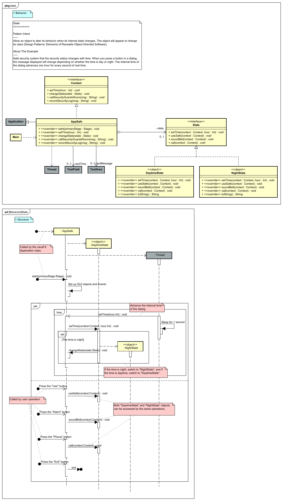</a> <a href="https://github.com/takaakit/design-pattern-examples-in-kotlin/tree/master/src/main/kotlin/behavioralPatterns/state">Kotlin Code</a> | <a href="https://htmlpreview.github.io/?https://github.com/takaakit/uml-diagram-for-kotlin-design-pattern-examples/blob/master/behavioralPatterns/strategy/DiagramMap.html">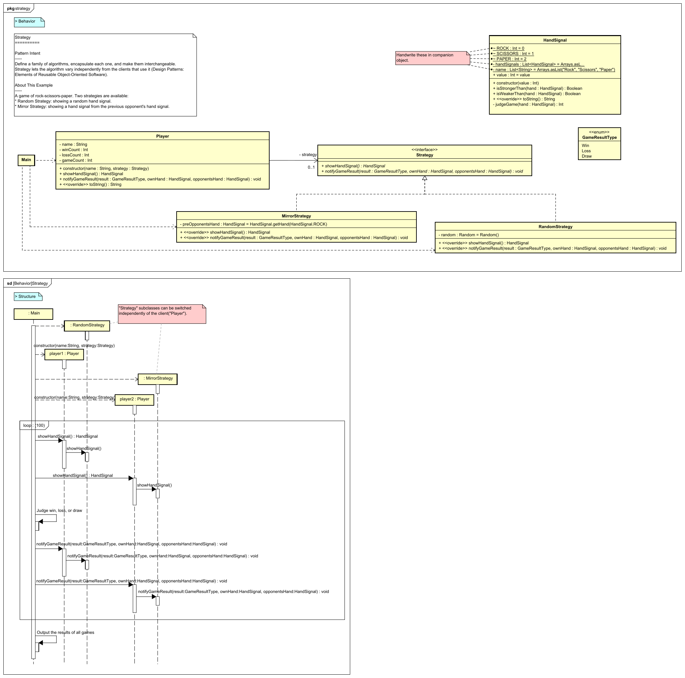</a> <a href="https://github.com/takaakit/design-pattern-examples-in-kotlin/tree/master/src/main/kotlin/behavioralPatterns/strategy">Kotlin Code</a> |
| **Template Method** | **Visitor** |  |
| <a href="https://htmlpreview.github.io/?https://github.com/takaakit/uml-diagram-for-kotlin-design-pattern-examples/blob/master/behavioralPatterns/templateMethod/DiagramMap.html">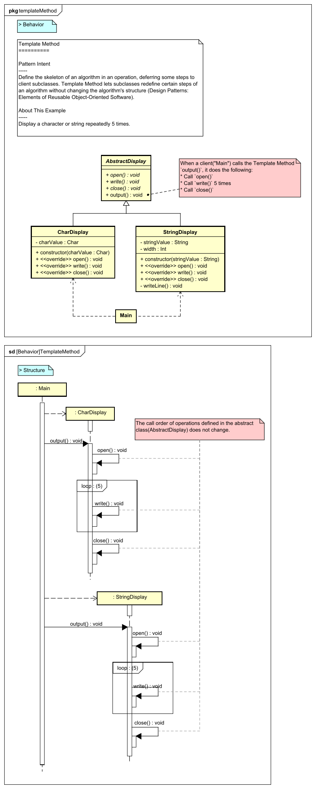</a> <a href="https://github.com/takaakit/design-pattern-examples-in-kotlin/tree/master/src/main/kotlin/behavioralPatterns/templateMethod">Kotlin Code</a> | <a href="https://htmlpreview.github.io/?https://github.com/takaakit/uml-diagram-for-kotlin-design-pattern-examples/blob/master/behavioralPatterns/visitor/DiagramMap.html">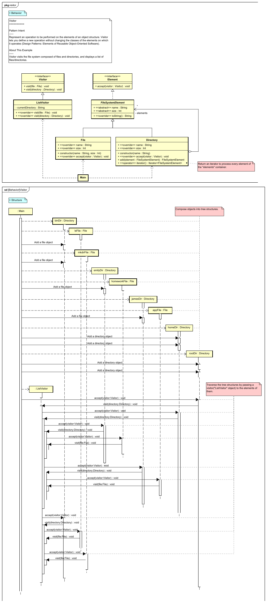</a> <a href="https://github.com/takaakit/design-pattern-examples-in-kotlin/tree/master/src/main/kotlin/behavioralPatterns/visitor">Kotlin Code</a> |  |

Creational Patterns
---
|  |  |  |
| :---: | :---: | :---: |
| **Abstract Factory** | **Builder** | **Factory Method** |
| <a href="https://htmlpreview.github.io/?https://github.com/takaakit/uml-diagram-for-kotlin-design-pattern-examples/blob/master/creationalPatterns/abstractFactory/DiagramMap.html">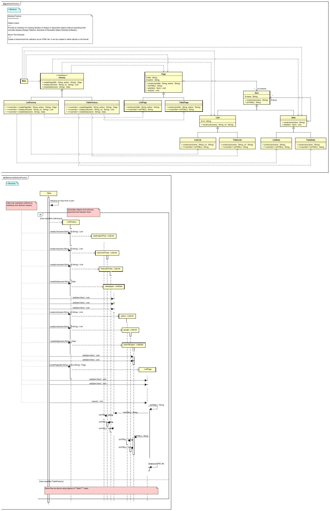</a> <a href="https://github.com/takaakit/design-pattern-examples-in-kotlin/tree/master/src/main/kotlin/creationalPatterns/abstractFactory">Kotlin Code</a> | <a href="https://htmlpreview.github.io/?https://github.com/takaakit/uml-diagram-for-kotlin-design-pattern-examples/blob/master/creationalPatterns/builder/DiagramMap.html">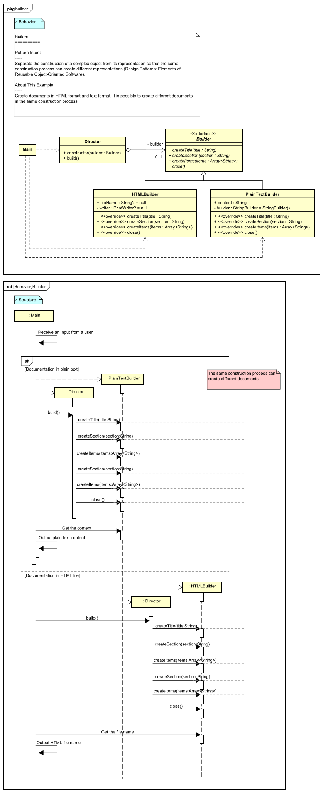</a> <a href="https://github.com/takaakit/design-pattern-examples-in-kotlin/tree/master/src/main/kotlin/creationalPatterns/builder">Kotlin Code</a> | <a href="https://htmlpreview.github.io/?https://github.com/takaakit/uml-diagram-for-kotlin-design-pattern-examples/blob/master/creationalPatterns/factoryMethod/DiagramMap.html">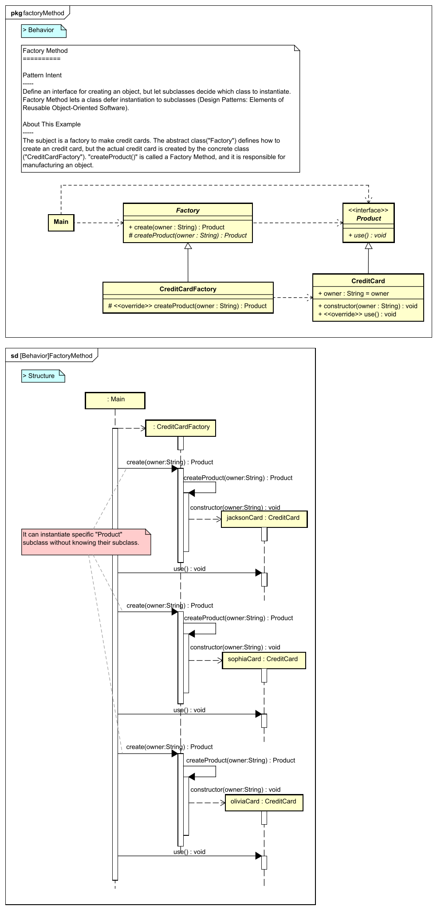</a> <a href="https://github.com/takaakit/design-pattern-examples-in-kotlin/tree/master/src/main/kotlin/creationalPatterns/factoryMethod">Kotlin Code</a> |
| **Prototype** | **Singleton** |  |
| <a href="https://htmlpreview.github.io/?https://github.com/takaakit/uml-diagram-for-kotlin-design-pattern-examples/blob/master/creationalPatterns/prototype/DiagramMap.html">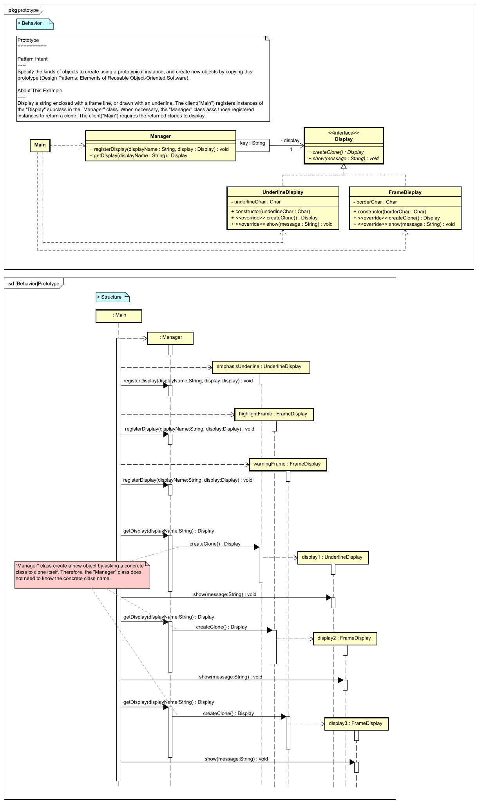</a> <a href="https://github.com/takaakit/design-pattern-examples-in-kotlin/tree/master/src/main/kotlin/creationalPatterns/prototype">Kotlin Code</a> | <a href="https://htmlpreview.github.io/?https://github.com/takaakit/uml-diagram-for-kotlin-design-pattern-examples/blob/master/creationalPatterns/singleton/DiagramMap.html">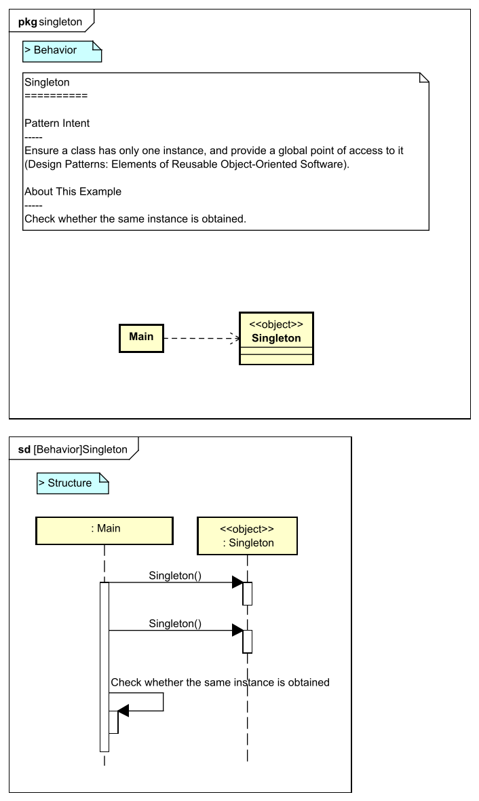</a> <a href="https://github.com/takaakit/design-pattern-examples-in-kotlin/tree/master/src/main/kotlin/creationalPatterns/singleton">Kotlin Code</a> |  |

Structural Patterns
---
|  |  |  |
| :---: | :---: | :---: |
| **Adapter** | **Bridge** | **Composite** |
| <a href="https://htmlpreview.github.io/?https://github.com/takaakit/uml-diagram-for-kotlin-design-pattern-examples/blob/master/structuralPatterns/adapter/DiagramMap.html">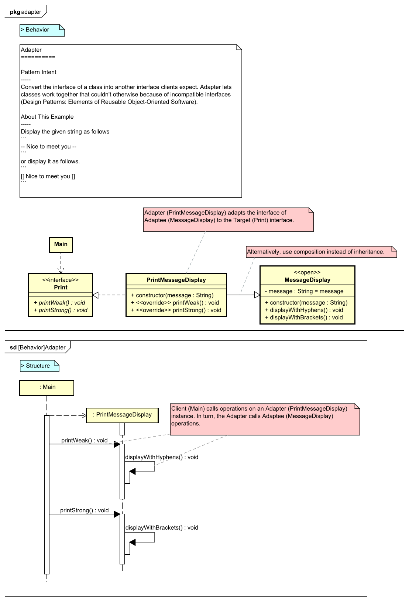</a> <a href="https://github.com/takaakit/design-pattern-examples-in-kotlin/tree/master/src/main/kotlin/structuralPatterns/adapter">Kotlin Code</a> | <a href="https://htmlpreview.github.io/?https://github.com/takaakit/uml-diagram-for-kotlin-design-pattern-examples/blob/master/structuralPatterns/bridge/DiagramMap.html">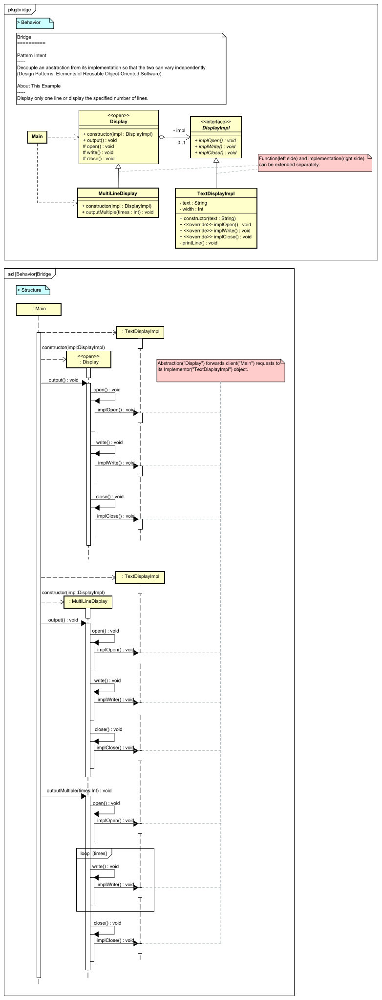</a> <a href="https://github.com/takaakit/design-pattern-examples-in-kotlin/tree/master/src/main/kotlin/structuralPatterns/bridge">Kotlin Code</a> | <a href="https://htmlpreview.github.io/?https://github.com/takaakit/uml-diagram-for-kotlin-design-pattern-examples/blob/master/structuralPatterns/composite/DiagramMap.html">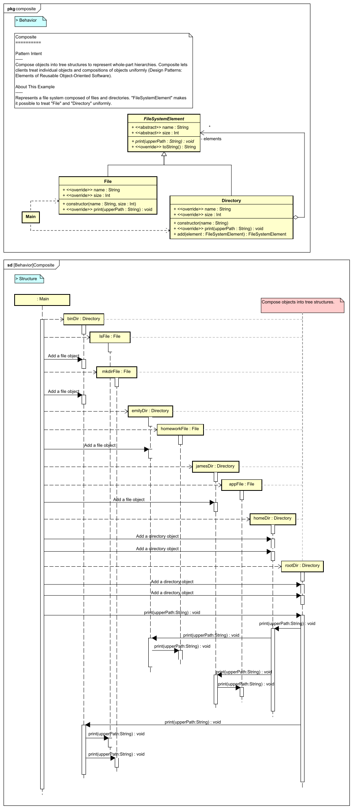</a> <a href="https://github.com/takaakit/design-pattern-examples-in-kotlin/tree/master/src/main/kotlin/structuralPatterns/composite">Kotlin Code</a> |
| **Decorator** | **Facade** | **Flyweight** |
| <a href="https://htmlpreview.github.io/?https://github.com/takaakit/uml-diagram-for-kotlin-design-pattern-examples/blob/master/structuralPatterns/decorator/DiagramMap.html">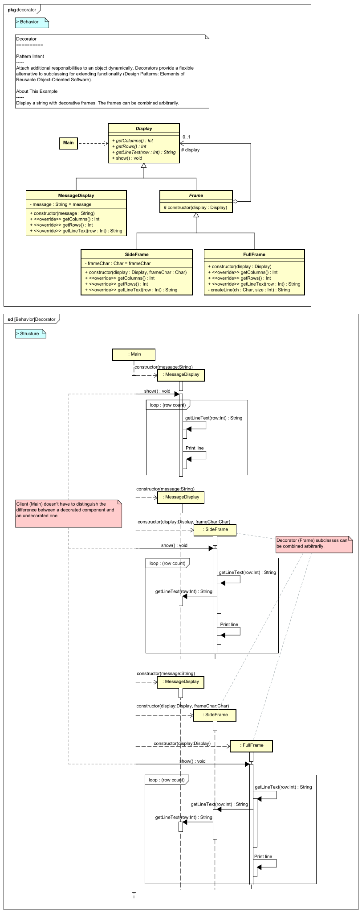</a> <a href="https://github.com/takaakit/design-pattern-examples-in-kotlin/tree/master/src/main/kotlin/structuralPatterns/decorator">Kotlin Code</a> | <a href="https://htmlpreview.github.io/?https://github.com/takaakit/uml-diagram-for-kotlin-design-pattern-examples/blob/master/structuralPatterns/facade/DiagramMap.html">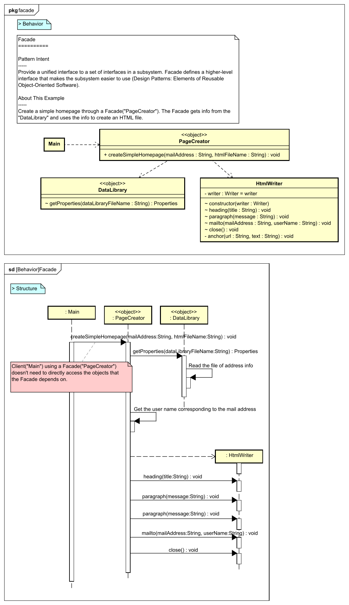</a> <a href="https://github.com/takaakit/design-pattern-examples-in-kotlin/tree/master/src/main/kotlin/structuralPatterns/facade">Kotlin Code</a> | <a href="https://htmlpreview.github.io/?https://github.com/takaakit/uml-diagram-for-kotlin-design-pattern-examples/blob/master/structuralPatterns/flyweight/DiagramMap.html">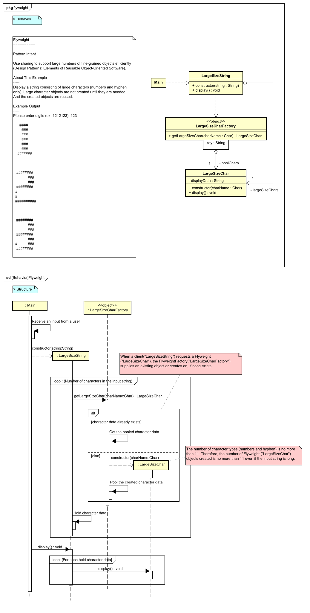</a> <a href="https://github.com/takaakit/design-pattern-examples-in-kotlin/tree/master/src/main/kotlin/structuralPatterns/flyweight">Kotlin Code</a> |
| **Proxy** |  |  |
| <a href="https://htmlpreview.github.io/?https://github.com/takaakit/uml-diagram-for-kotlin-design-pattern-examples/blob/master/structuralPatterns/proxy/DiagramMap.html">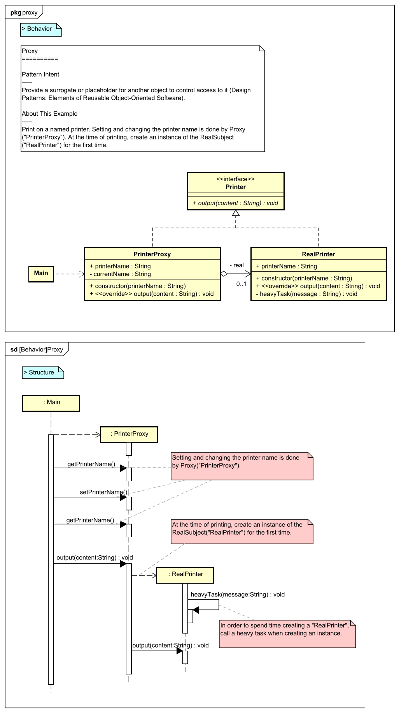</a> <a href="https://github.com/takaakit/design-pattern-examples-in-kotlin/tree/master/src/main/kotlin/structuralPatterns/proxy">Kotlin Code</a> | | |

References
---
* Gamma, E. et al. Design Patterns: Elements of Reusable Object-Oriented Software, Addison-Wesley, 1994
* Hiroshi Yuki. Learning Design Patterns in Java [In Japanese Language], Softbank publishing, 2004

Links
---
* [Design Pattern Examples in Kotlin](https://github.com/takaakit/design-pattern-examples-in-kotlin)
* [Diagram Map: tracing UML/SysML elements across diagrams](https://dev.to/takaakit/diagram-map-tracing-uml-sysml-elements-across-diagrams-49i7)

Licence
---
Diagram Map file (DiagramMap.html) includes the following libraries:
* [D3 library](https://d3js.org) is copyrighted by Mike Bostock and is released under the [BSD license](https://opensource.org/licenses/BSD-3-Clause).
* [Popper library](https://popper.js.org/) is copyrighted by Federico Zivolo and is released under the [MIT license](https://opensource.org/licenses/MIT).
* [Tippy library](https://atomiks.github.io/tippyjs/) is copyrighted by atomiks and is released under the [MIT license](https://opensource.org/licenses/MIT).

Files and data in this project other than the above libraries are under the [Creative Commons Zero (CC0) license](https://creativecommons.org/publicdomain/zero/1.0/).
